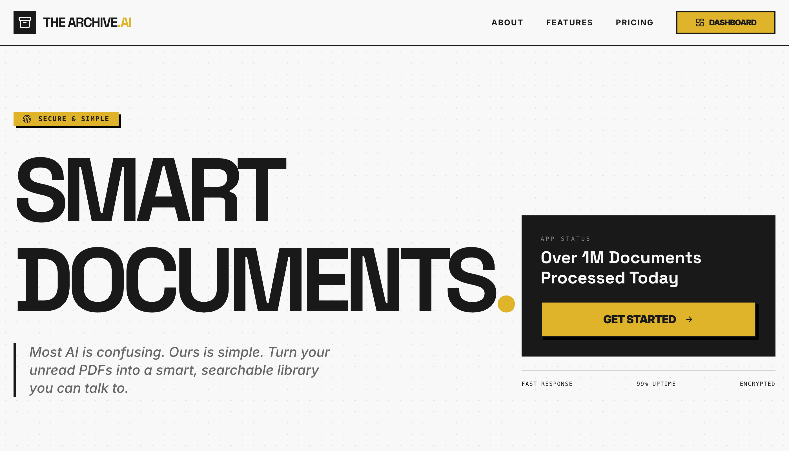

# The Archive — AI Document Intelligence

**The Archive** is a RAG-powered (Retrieval-Augmented Generation) document analysis platform. Upload PDFs, DOCX, or TXT files and chat with them using AI. The system extracts and chunks your documents, generates embeddings, and answers questions by citing only what's in your files — no hallucination.

---



## Open Source

The Archive.ai is open source under the [MIT License](LICENSE). Contributions, issue reports, and security disclosures are welcome.

- Read [CONTRIBUTING.md](CONTRIBUTING.md) before opening a pull request.
- Report vulnerabilities privately through the process in [SECURITY.md](SECURITY.md).
- Use `.env.example` as the template for local secrets; never commit real API keys, service role keys, webhook secrets, or production credentials.

---

## What It Does

- Upload PDF, DOCX, and TXT files via drag-and-drop
- AI-powered Q&A chat grounded in your uploaded documents
- Auto-generates a TL;DR (executive summary) on upload
- Citation tracking — every AI answer references its source document
- Document library with search and filtering
- In-browser PDF preview modal
- Brutalist UI design with dark mode support

---

## Tech Stack

| Layer        | Technology                                                          |
| ------------ | ------------------------------------------------------------------- |
| Framework    | Next.js 16 (App Router) + React 19 + TypeScript                     |
| Styling      | Tailwind CSS + Radix UI (headless) + shadcn/ui                      |
| AI Models    | OpenAI `gpt-4o-mini` (chat) + `text-embedding-3-small` (embeddings) |
| AI SDK       | Vercel AI SDK v6 (`generateText`, `embed`)                          |
| File Parsing | `pdf-parse` for PDF text extraction                                 |
| Forms        | React Hook Form + Zod                                               |
| File Upload  | React Dropzone                                                      |
| Deployment   | Firebase App Hosting                                                |

---

## Project Structure

```
the-archive-ai/
├── src/
│   ├── app/
│   │   ├── page.tsx                  # Landing page
│   │   ├── layout.tsx                # Root layout & metadata
│   │   ├── globals.css               # Global styles & CSS variables
│   │   ├── dashboard/
│   │   │   ├── layout.tsx            # Dashboard shell with sidebar
│   │   │   ├── page.tsx              # Overview / stats
│   │   │   ├── chat/page.tsx         # Chat interface
│   │   │   ├── documents/page.tsx    # Document library & upload
│   │   │   └── settings/page.tsx     # Settings
│   │   └── api/
│   │       └── extract-text/route.ts # PDF/text extraction API route
│   ├── ai/
│   │   ├── openai.ts                 # OpenAI client config
│   │   └── flows/
│   │       ├── rag-query-response-generation.ts    # RAG chat flow
│   │       └── document-embedding-processing.ts    # Chunking & embedding flow
│   ├── components/
│   │   ├── chat/chat-window.tsx      # Main chat UI
│   │   ├── documents/
│   │   │   ├── upload-zone.tsx       # Drag-and-drop uploader
│   │   │   └── document-list.tsx     # Document library list
│   │   ├── layout/                   # Header & footer
│   │   └── ui/                       # Radix-based UI primitives (37 components)
│   ├── hooks/                        # use-mobile, use-toast
│   └── lib/
│       ├── types.ts                  # Shared TypeScript interfaces
│       └── utils.ts                  # cn() and other helpers
├── .env                              # Environment variables (see below)
├── next.config.ts
├── tailwind.config.ts
├── apphosting.yaml                   # Firebase App Hosting config
└── package.json
```

---

## How It Works (RAG Pipeline)

1. **Upload** — file is sent to `/api/extract-text`, which uses `pdf-parse` to extract raw text
2. **Chunk** — `document-embedding-processing.ts` splits text into ~1000-char segments at paragraph/sentence boundaries
3. **Embed** — each chunk is embedded with `text-embedding-3-small`
4. **Query** — user message is embedded and matched against stored chunk embeddings (cosine similarity)
5. **Generate** — top matching chunks are passed as context to `gpt-4o-mini` via the RAG flow, which is instructed to answer only from the provided documents

---

## Setup

### Prerequisites

- Node.js 22
- An [OpenAI API key](https://platform.openai.com/api-keys)
- A Supabase project with Auth enabled
- Stripe account credentials if you want paid plans and billing flows

### 1. Clone & install

```bash
git clone https://github.com/SawSimonLinn/the-archive-ai.git
cd the-archive-ai
npm install
```

### 2. Configure environment variables

Create a `.env` file in the project root. Use `.env.example` as the template:

```env
NEXT_PUBLIC_SUPABASE_URL=https://your-project.supabase.co
NEXT_PUBLIC_SUPABASE_ANON_KEY=your-anon-key
SUPABASE_SERVICE_ROLE_KEY=your-service-role-key
OPENAI_API_KEY=your-openai-api-key
STRIPE_SECRET_KEY=your-stripe-secret-key
STRIPE_WEBHOOK_SECRET=your-stripe-webhook-secret
NEXT_PUBLIC_STRIPE_PUBLISHABLE_KEY=your-stripe-publishable-key
STRIPE_PRO_PRICE_ID=your-pro-price-id
STRIPE_TEAM_PRICE_ID=your-team-price-id
STRIPE_LIVE_TEST_PRICE_ID=your-live-test-price-id
NEXT_PUBLIC_APP_URL=http://localhost:9002
```

### 3. Set up Supabase database and storage

For a fresh Supabase project, open **Supabase Dashboard > SQL Editor** and run:

```sql
-- docs/migration_000_initial_schema.sql
```

That bootstrap migration creates the app tables, `pgvector` extension, private
`documents` storage bucket, row-level security policies, storage policies, and
the `match_document_chunks` RPC used by semantic search.

The other `docs/migration_*.sql` files are incremental migrations kept for
existing deployments. They are idempotent, but new self-hosted installs should
start with `docs/migration_000_initial_schema.sql`.

### 4. Run the development server

```bash
npm run dev
```

The app runs at [http://localhost:9002](http://localhost:9002)

## Available Scripts

| Script                 | Description                                       |
| ---------------------- | ------------------------------------------------- |
| `npm run dev`          | Start Next.js dev server on port 9002 (Turbopack) |
| `npm run build`        | Production build                                  |
| `npm start`            | Start production server                           |
| `npm run typecheck`    | TypeScript type check (no emit)                   |
| `npm run readiness:static` | Verify repo-level production readiness assumptions |
| `npm run test:smoke`   | Smoke-test auth, upload, chat, billing, and webhook routes |
| `npm run ci`           | Run audit, readiness, typecheck, build, and smoke tests |

---

## Environment Variables

| Variable                             | Required    | Description                                                                                             |
| ------------------------------------ | ----------- | ------------------------------------------------------------------------------------------------------- |
| `OPENAI_API_KEY`                     | Yes         | OpenAI API key used for GPT-4o-mini and text embeddings                                                 |
| `NEXT_PUBLIC_SUPABASE_URL`           | Yes         | Supabase project URL                                                                                    |
| `NEXT_PUBLIC_SUPABASE_ANON_KEY`      | Yes         | Supabase browser anon key                                                                               |
| `SUPABASE_SERVICE_ROLE_KEY`          | Yes         | Supabase service role key for server-only admin operations                                              |
| `STRIPE_SECRET_KEY`                  | Yes         | Stripe secret key for Checkout, subscriptions, invoices, and portal sessions                            |
| `STRIPE_WEBHOOK_SECRET`              | Yes         | Stripe webhook endpoint signing secret for `/api/stripe/webhook`                                        |
| `NEXT_PUBLIC_STRIPE_PUBLISHABLE_KEY` | Yes         | Stripe publishable key used by browser-facing billing flows                                             |
| `STRIPE_PRO_PRICE_ID`                | Yes         | Stripe recurring monthly Price ID for the Pro plan                                                      |
| `STRIPE_TEAM_PRICE_ID`               | Yes         | Stripe recurring monthly Price ID for the Team plan                                                     |
| `STRIPE_LIVE_TEST_PRICE_ID`          | Optional    | Hidden live-mode recurring Price ID used for launch checkout/cancellation smoke tests                   |
| `NEXT_PUBLIC_APP_URL`                | Recommended | Production app origin for callbacks and billing redirects; use `https://thearchiveai.xyz` in production |

## Supabase Auth Redirects

The app sends OAuth users back to the same host they started from. To support both local development and production for providers like Google and GitHub, configure Supabase Auth like this:

- Site URL: `https://thearchiveai.xyz`
- Redirect URLs: add every callback origin you use, including `http://localhost:9002/auth/callback` and `https://thearchiveai.xyz/auth/callback`

For local development, keep using `http://localhost:9002/auth`. For production, use `https://thearchiveai.xyz/auth`. The code keeps localhost callbacks local during development and uses the configured production origin for deployed auth and billing redirects.

---

## Deployment

The project is configured for **Firebase App Hosting** via `apphosting.yaml`.

Before deploying, complete the production checklist in
[`docs/production-readiness.md`](docs/production-readiness.md): run the Supabase
bootstrap migration, create App Hosting secrets, configure Supabase Auth redirect URLs,
configure the Stripe webhook endpoint, and smoke-test the deployed app.

```bash
npm run build
# then deploy via Firebase CLI or push to connected repo
```

---

## License

The Archive.ai is released under the [MIT License](LICENSE).
